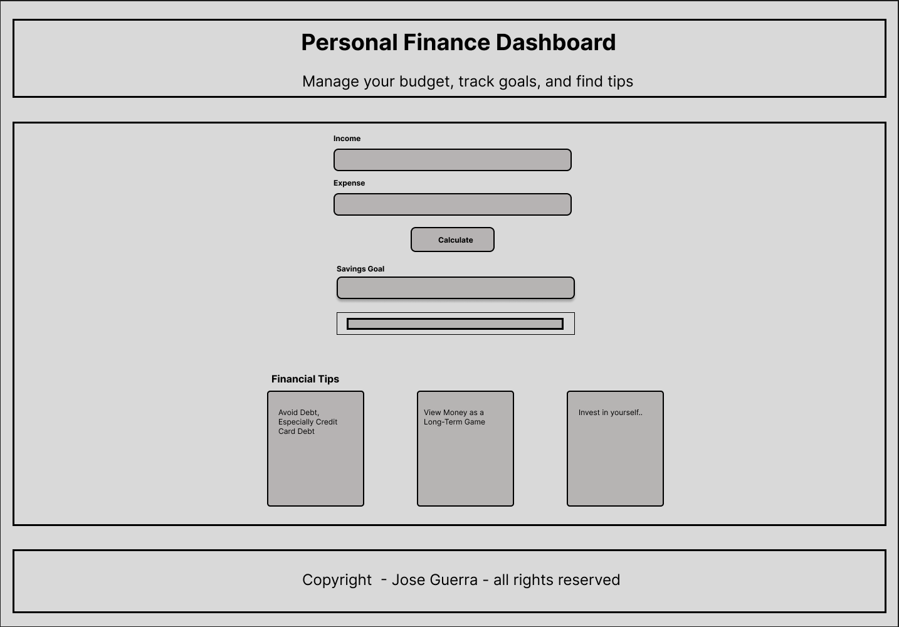
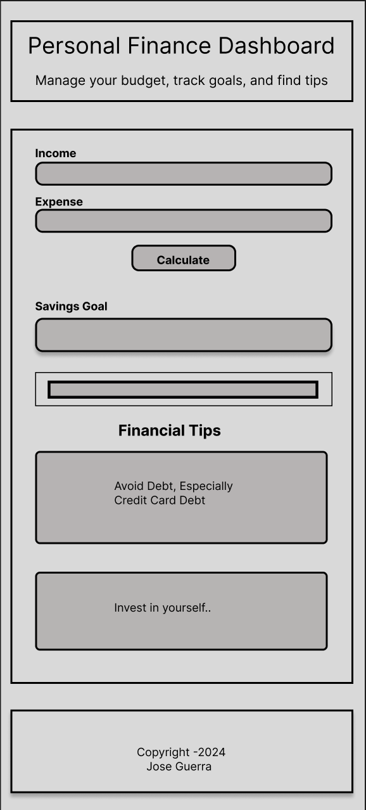

# Personal Finance Dashboard

## Overview

The **Personal Finance Dashboard** is a static web project designed to help users manage their budgets, track expenses, set saving goals, and explore practical finance tips. Build with HTML, CSS, and JavaScript, the project demostrates a clean, interactive, and responsive use interface.

This project is develop following **Agile principles**, ensuring iterative progress, clear deliverables, and user-centric design.

---

## The target user for the website is

- English speaker.
- Interested in managing their finance.

---

## Goal

- Create a visually appealing and responsive static web application.
- Build interactive tools like a budget planner and savings tracker.
- Load financial tips dynamically from a JSON file.
- Showcase core web development skills (HTML5, CSS3, JavaScript).
- Adhere to Agile practices during development.

---

## Features

1. **Budget Planner**:

   - Users can input income and expenses.
   - Dynamically calculates and displays the remaining balance.

2. **Saving Goals Tracker**:

   - Users can set a savings goal and track progress visually.
   - Includes a responsive progress bar.

3. **Financial Tips**:

   - Tips are dynamically loaded from a JSON file.
   - Highlights best practices for personal finance management.

4. **Dark/Light Mode Toggle** (optional goal).

---

## Agile workflow

### Sprint 1: Initial Setup and Basic Structure

- Define project requirements and user stories
- Set up the file structure.
- Build the basic HTML structure.

### Sprint 2: Styling and Responsiveness

- Add CSS for layout and styling.
- Ensure a mobile-first, responsive desing.

### Sprint 3: Interactivity

- Implement JavaScript functionality for the budget planner and savings tracker.
- Integrate a JSON-based tips section.

### Sprint 4: Testing and Enhancements

- Test across differente browsers and devices.
- Optimize code for performance.
- Add optional features like theme toggling.

---

## User Stories

1. **As a user**, I want to input my income and expenses **so I can** calculate my remaining bugdet.
2. **As a user**, I want to set a savings goal **so I can** visualize my progress.
3. **As a user**, I want to view actionable financial tips to improve my budgeting.
4. **As a user**, I want the dashboard to be reponsive **so I can** use it on any device.

---

## Tech Stack

- **Frontend**: HTML5, CSS3, JavaScript.
- **Styling Framework**: Bootstrap (optional for responsiveness)
- **Chart Library**: Chart.js or D3.js (optional for data visualization).
- **Hosting**: Github Pages

---

## Wireframes

1. **Desktop**:

   - 

2. **Mobile**:

   - 

---

## Installation and Usage

1. Clone the repository:

   ```bash
   git clone https://github.com/yourusername/personal-finance-dashboard.git
   ```

2. Navigate to the project directory:

   ```bash
   cd personal-finance-dashboard
   ```

3. Open `index.html` in your browser to view the site.

---

## Roadmap

- **Phase 1**: Core functionality (Budget Planner, Savings Tracker).
- **Phase 2**: Styling and responsiveness.
- **Phase 3**: Dinamic content loading.
- **Phase 4**: Optional features (Dark/Light Mode, additional tips).

---

## Contributing

Contributions are welcome! Feel free to fork the repository, make changes, and submit a pull request.

---

## License

This project is licensed under the [MIT license](LICENSE).
